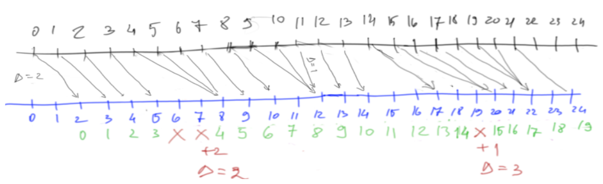

# Client Side Prediction Module
This module provides a framework for implementing client-side prediction for networked moving vehicles in Unity.

The system is built with a couple assumptions in place, so it will not be a generic framework.

### Assumptions
1. Each client predicts exactly one entity at any point in time (typically the player's character).
2. Client side collision precision is not critical. The game this is designed for is a fast paced movement based flying game. It is fine for the airplane to appear to pass through obstacles as long as the consequence follows relatively quickly from server authoritative state updates.

### Invariants
1. **Authoritative Server**: The server is the authoritative source of truth for the game state. Clients can predict their own actions, but the server ultimately decides the correct state.
2. **Server Forward Only Simulation**: The server only simulates forward in time and does not perform any rewinding or rollback of the game state.
3. **Client needs to resimulate physics**: The client is responsible for resimulating physics from the last confirmed server state to the current predicted state whenever de discrepancy between predicted state and server state drifts past a certain threshold.
4. **Resimulation must be as cheap as possible**: The action of re-simulating inputs should be optimized as much as possible. If it is possible to resimulate the whole world, we could do it. However, it is likely that we should only resimulate movement without obstacles.
5. **Uniform Tick Rate**: Both the client and server operate on a uniform tick rate for processing inputs and updating game state. This ensures consistency in how inputs are applied over time as well as enables server and client to have a common reference frame.

## Maintaining comparable Tick IDs between client and server
The server tick_id does not matter to the client because it is likely vastly out of sync. However, we can use the fact that both Server and Client run at the same Tick Rate:

When the client sends an input to the server, it includes its current **tick_id**. From the server's perspective, this is always considered as latest input.
The server applies the received input, advances the simulation by one tick and sends back the entity physics state with this new **tick_id**. Even if there is packed drop and inputs from the client are missed, the server can still "estimate" the client's tick rate using the last received **tick_id** and incrementing it by how many simulation steps it has run since then (because it runs at the same tick rate as the client).

### Why is this important?
For each state update from the server, the client needs to know which past input this corresponds to with minimal error. This information is used for both checking when to do a resimulation as well as ensuring the simulation is as accurate as possible.

# Problem Framing
Both the server and client will tick at a fixed rate of TR Hz. Where TR = 50 by default.
This means that the server and client will be out of sync by roughly 1/TR seconds. This should be acceptable for high values of TR.

Ok now let's look at how Prediction can work.

The implementation will take control of the Physics simulation, it will explicitly call the Simulation step at the fixed rate TR.

# Perfect Network
A perfect network has zero data loss and constant latency.

**client** does the following for every tick:
- Sample player input
- Calculates and applies physics forces
- Runs physics simulation step
- Sends inputs to server

This way the client immediately sees the outcome of their actions, does not experience 2 x CONST_POINT_TO_POINT_DELAY

**server** does the following for every tick
- Reads next client input
- Calculates and applies Physics forces
- Runs physics simulation step

The server does the following when a new update arrives from the client:
- Adds it to the input queue

Now because the network is perfect, each update arrives at the server exactly CONST_P2P_DELAY seconds later, no loss, no reordering happened.

## Server Additional Tick

This can become problematic over time as more server ticks run without client input and requires client resimulation if the two perspectives drift too far apart.

## Client Additional Tick

Server will buffer any additional data and still apply it at the correct time from it's perspective. The outcome is that it will fall further behind by one tick in this case.

Ok so it is possible for the client and server to get out of sync if their tick intervals can fluctuate. Easy fix, we have a perfect network:

**server** does the following on every tick:
- Send a snapshot of the state of the predicted entity

**client** on every state update from the server:
- Check how far it's simulation has drifted from the servers
- If too much, resimulate from server state all of the inputs that followed it.

How does the client know what inputs to resimulate? Easy, perfect network means constant latency so that means the last n ticks. N = LATENCY / TR

## Lantency
Let's now add latency to the mix. Network still has no loss, everything arrives in the order it was sent, but there are random spikes in latency.

If the server could pause and wait out the latency, there would be no problem. But it cannot, the Simulation must continue even when no data is available from the client for the next tick.

Here comes another problem:  
Simulation steps without client input will certainly lead the server and client positions to drift apart
Server keeps lagging further from the client with each missed input. Note: the delay would have to get bigger and bigger for subsequent inputs to be missed due to buffering.
(If no input available, don't increment tick)

Alternative:  
Skip over inputs that are for a tick that the server already simulated, they are no longer relevant.
Note: depending on the game, maybe these skipped ticks can be aggregated and applied together with the next relevant client tick.

Issue: network starts faster then gets slower, this method will have issues catching up. This could be mitigated with a configurable buffering delay before the Simulation starts on the server.

This is probably a bad alternative. Would rather use buffering and come up with policies for skipping ahead in the buffer.

## Resimulation
In any case there will be a need to resimulate on the client, to bring it back on track with the server. As long as this is not noticeable and doesn't cause perf issues, its OK.

**Issue**: How does the client know what ticks to replay on top of the latest server state report?
Getting this wrong could result in a useless resimulation which is just as far from the server's next state or even worse… resulting in another resim, and another, … etc.

**Solution**: server sends back the client reported tick in its state updates. This allows the client to precisely determine what are the remaining ticks as well as how far in the past is the server report.

Both these solutions would work with TCP (no drop and no reorder).

## Packet Drop
In the case of packet, both server and client need to have the ability to handle gaps in the tick_id stream of updates coming from each other.

### The client
- When a newer tick arrives, replace the current latest.

If a server tick caused resimulation, then it should not be used for resimulation ever again. Only newer ticks should.

Note: for more complex analysis of server vs client state, all server updates can be buffered but sorted by tick_id.

### The server
The server will continue simulating even without client input. So the only question here is what happens to the tick_id.
- Remain unchanged until new ticks arrive.
- Continue ticking upland ignore new ticks that arrived too late

## Packet Reorder   
In this situation you can have older ticks arrive after new ones:
2 3 4 7 6 5 8 9 …

We need to handle reordering.

### The client
If the tick-id of the latest received message is smaller than the largest tick we ever received, either:
- Ignore this message
- Buffer the message, this won't change what the latest server state is and won't be eligible for checking if resimulation is needed
- 
Else 
- add this message to the server state buffer, this is now the latest server state, check if resimulation is needed.

### The server
If the tick-id of the latest message is smaller than the current server tick-id ( remember this number is supplied by the client) 
- then ignore

Else
- buffer the message, sorted by tick-id.

Note: the larger this input buffer is, the further behind the client the server is. Past a certain threshold the client will not notice world events like collisions with other bodies.

Note: it is important how the tick-id is advanced on the server as this impacts both accuracy of the server simulation accuracy and lagging behind the client.

How can the client tell how delayed the server is = current_tick - last_server_tick  
How can the server tell how far ahead the client is = last_buffered_tick - last_applied_tick

It may be necessary for both to try to resolve this delay:  
The client can try to skip simulation ticks, hence not incrementing the tick  
The server can try to skip over buffered ticks, hence possibly causing a resimulation on the client.

### Server Tick Progression  
- Server starts with tick_id = 0  
- It changes the tick_id only when it applies client reported input or skips client reported input.  
- When client reported input arrives:  
- - IF the input.tick_id > tick_id == the server buffers it sorted by input.tick_id
- - Else the server ignores the message as it is likely a late out of order packet.
- On every simulation step:
- - Look for a buffered client input with input.tick_id > tick_ id
- - If found == then set tick_id to input.tick_ id and apply the input
- - Run simulation step
- - Send status update to client keyed with tick_ id

TODO - reason about ticks meaning the same thing for client and server (i.e. always after or before simulation)  
TODO - come up with policies for when to skip ahead the server buffers  
TODO - come up with a policy to slow down the client if too far ahead  
